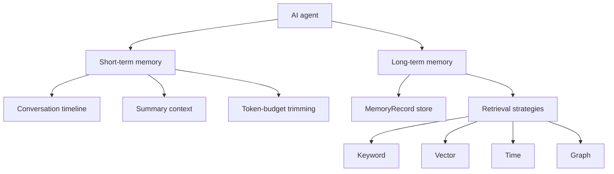
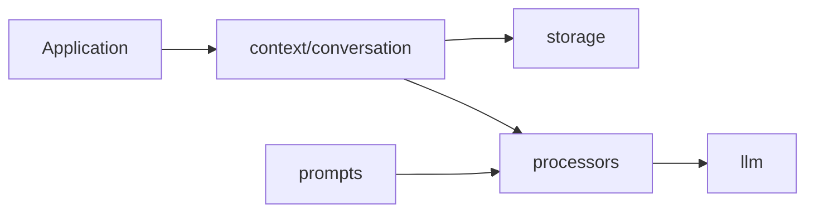

# Agent Memory From Scratch

An experimental Python implementation of memory architecture for AI agents, built from scratch.

The purpose of this repo is to explore how memory systems for AI agents should be designed when they need to survive beyond a single prompt. It starts with the foundations: conversation state, persistence, context trimming, summarization, and model-facing message boundaries. From there, it will grow into long-term memory, semantic retrieval, profile memory, knowledge ingestion, caching, multi-agent shared memory, and other capabilities as agent memory patterns continue to evolve.

The project is organized around one simple idea:

```text
agents need different memory layers for different jobs
```

Conversation history, summaries, user preferences, project decisions, semantic facts, episodic events, and procedural rules should not be treated as one vague blob of chat history. They need clear models, storage boundaries, and retrieval strategies.

## Architecture Docs

Start with the short-term memory architecture:

[Short-Term Memory](docs/short-term-memory.md)

Then read the long-term memory direction:

[Long-Term Memory](docs/long-term-memory.md)

## Capabilities

Implemented now:

```text
persistent conversation memory across sessions
thread-scoped short-term memory
token-budget context trimming
summary-based context compression
persisted summaries as derived timeline items
in-process, JSON, Markdown, SQLite, and cached storage
provider-neutral LLM message boundary
YAML prompt loading
```

Planned capabilities:

```text
long-term MemoryRecord store
semantic retrieval with embeddings and vector search
keyword, vector, time, and graph retrieval strategies
memory extraction from conversations into semantic, episodic, procedural, preference, and decision records
profile-style entity memory for durable user or project facts
knowledge base ingestion for files and folders
configurable chunking for ingested documents
semantic cache to reduce repeated LLM calls
multi-agent shared memory / blackboard patterns
context-window telemetry and budget reporting
tool-call memory records
integrations for external memory systems
```

The repo intentionally starts with primitives before integrations. The goal is to understand and own the architecture before plugging in vector databases, external memory systems, agent frameworks, or UI layers.

## Memory Layers



Short-term memory answers:

```text
What happened in this thread?
```

Long-term memory answers:

```text
What should be reusable later?
```

## Architecture Principles

The codebase separates concepts that are often mixed together:

```text
context    -> what the agent/model should know
storage    -> where memory is persisted
retrieval  -> how memory is searched
llm        -> provider-neutral model messages and invocation
prompts    -> versioned prompt templates
```

The short-term memory implementation already follows this boundary:



Long-term memory follows the same principle:

```text
MemoryRecord is the source of truth.
Retrievers make records searchable.
```

Vectors, keyword search, graph edges, and timestamps are retrieval structures. They are not the memory itself.

## Repository Shape

```text
src/agent_memory/
  context/
    conversation/     # short-term conversation memory
    profile/          # reserved for profile memory
    semantic/         # reserved for semantic memory concepts

  storage/            # persistence backends
  llm/                # provider-neutral LLM boundary
  prompts/            # YAML prompt templates
  long_term/          # long-term memory records, store protocol, retrievers
  retrieval/          # keyword, vector, time, and graph retrieval strategies
  ingestion/          # file/source loading into memory records
  integrations/       # external memory systems such as Mem0 or Zep
  settings.py
  errors.py

docs/
  short-term-memory.md
  long-term-memory.md
```

## Implemented

Short-term memory foundation:

```text
ConversationState
ConversationMemory
Message
SummaryItem
ConversationStorage protocol
```

Context management:

```text
token-budget trimming
summary-based compression
summary persistence as derived timeline items
```

Storage:

```text
in-process storage
JSON storage
Markdown storage
SQLite storage
cached storage composition
```

LLM boundary:

```text
SystemMessage
HumanMessage
AIMessage
ToolMessage
ChatModel protocol
internal-to-LLM message adapters
```

Prompt management:

```text
YAML prompt files
prompt loader
conversation summary prompt
```

## Long-Term Memory Direction

Long-term memory will use one record model:

```text
namespace + key + value + memory_type + metadata
```

Memory categories are represented by `memory_type`:

```text
semantic
episodic
procedural
preference
decision
```

Retrieval is handled through strategies:

```text
keyword retrieval
vector retrieval
time retrieval
graph / relationship retrieval
```

This avoids creating separate memory systems too early while still supporting production retrieval patterns.

## Documentation

Start here:

[Short-Term Memory](docs/short-term-memory.md)

Explains thread-scoped conversation memory, token-budget trimming, summary compression, persisted summaries, storage backends, and the LLM boundary.

[Long-Term Memory](docs/long-term-memory.md)

Explains the planned long-term architecture: `MemoryRecord` source of truth, retrieval strategies, semantic memory, episodic memory, procedural memory, preference memory, and decision memory.

## Examples

```bash
PYTHONPATH=src python examples/conversation_memory.py
PYTHONPATH=src python examples/conversation_summary.py
PYTHONPATH=src python examples/persisted_summary.py
PYTHONPATH=src python examples/process_and_persist_summary.py
PYTHONPATH=src python examples/json_storage.py
PYTHONPATH=src python examples/markdown_storage.py
PYTHONPATH=src python examples/sqlite_storage.py
PYTHONPATH=src python examples/cached_storage.py
```

## Roadmap

Next major work:

```text
long-term MemoryRecord model
long-term memory store protocol
keyword retriever
vector retriever with pluggable embeddings
memory extraction from conversation messages
retrieval across namespaces
```

The intent is to build the memory system from first principles while keeping the architecture compatible with how modern agent frameworks separate state, persistence, retrieval, and model context.
