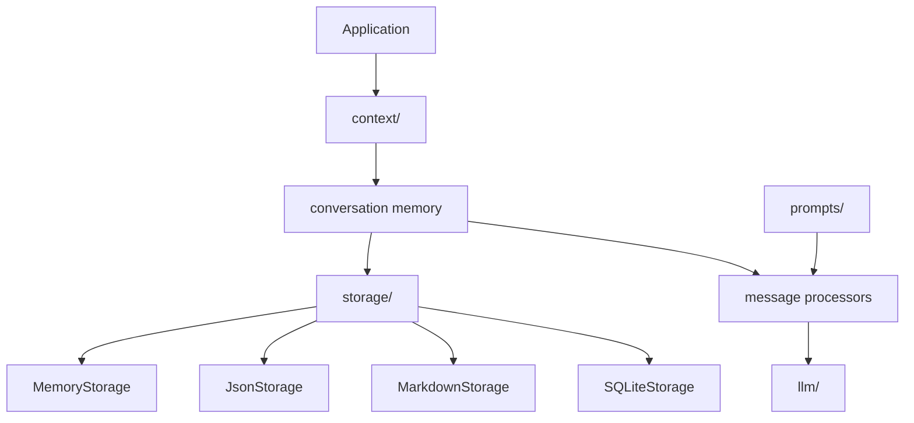

# LLM Memory From Scratch

A Python implementation of memory primitives for LLM applications.

The project separates three concerns that are often mixed together:

```text
context    -> what the model should know
storage    -> where conversation state is persisted
llm        -> provider-neutral model messages and invocation
```

The current implementation focuses on short-term conversation memory: raw message history, storage backends, summary-based context compression, and a clean model boundary.

## Architecture



```text
src/llm_memory/
  context/
    conversation/
      state.py        # ConversationItem, Message, SummaryItem, ConversationState
      memory.py       # ConversationMemory public API
      processors.py   # Message history processors
    profile/          # reserved for profile memory
    semantic/         # reserved for semantic long-term memory

  storage/
    interface.py      # ConversationStorage protocol
    memory.py         # in-process storage
    json.py           # JSON file storage
    markdown.py       # Markdown file storage
    sqlite.py         # SQLite storage
    cached.py         # cache + primary storage composition

  llm/
    message.py        # SystemMessage, HumanMessage, AIMessage, ToolMessage
    interface.py      # ChatModel protocol
    adapters.py       # internal conversation messages -> LLM messages

  prompts/
    loader.py
    conversation_summary.yaml

  settings.py
  errors.py
```

## Core Ideas

Conversation memory stores the full timeline for a thread.

```text
Message
Message
SummaryItem
Message
```

Raw messages remain the source of truth. Summaries are derived context that can reduce model input size without deleting the original conversation.

The model-facing context can be smaller than the stored timeline:

```text
summary of older messages
+
recent raw messages
```

This follows the same practical shape used by modern agent frameworks: persist conversation state, process message history before model invocation, and keep storage separate from prompt construction.

## Short-Term Memory

`ConversationMemory` is the public API for thread-level memory.

```python
from llm_memory.context.conversation.memory import ConversationMemory
from llm_memory.storage.memory import MemoryStorage

memory = ConversationMemory(storage=MemoryStorage())

memory.add_message(
    thread_id="thread-1",
    role="user",
    content="Explain conversation memory.",
)

messages = memory.get_messages("thread-1")
```

## Summary Processing

`SummarizeOldMessagesProcessor` summarizes older messages and keeps recent messages raw.

It does not delete stored messages. It prepares model context.

```python
from llm_memory.context.conversation.processors import ProcessingContext
from llm_memory.context.conversation.processors import SummarizeOldMessagesProcessor

processor = SummarizeOldMessagesProcessor(
    model=summary_model,
    trigger_message_count=8,
    keep_recent_messages=4,
)

model_context = processor.process(
    messages=memory.get_messages("thread-1"),
    context=ProcessingContext(),
)
```

Summaries can also be persisted explicitly as `SummaryItem`.

```python
summary_message = model_context[0]
covered_item_ids = summary_message.metadata["covered_item_ids"]

memory.add_summary(
    thread_id="thread-1",
    content=summary_message.content.removeprefix(
        "Conversation summary so far:\n"
    ),
    covered_item_ids=covered_item_ids,
)
```

## Storage Backends

The same `ConversationMemory` API works with different storage backends:

```python
from pathlib import Path

from llm_memory.context.conversation.memory import ConversationMemory
from llm_memory.storage.sqlite import SQLiteStorage

storage = SQLiteStorage(Path(".memory") / "conversations.db")
memory = ConversationMemory(storage=storage)
```

Available storage backends:

```text
MemoryStorage
JsonStorage
MarkdownStorage
SQLiteStorage
CachedConversationStorage
```

## LLM Boundary

The LLM interface is provider-neutral:

```python
class ChatModel(Protocol):
    def invoke(self, messages: list[Message]) -> AIMessage:
        ...
```

Internal conversation messages are separate from model-facing messages.

```text
context.conversation.state.Message  -> stored conversation item
llm.message.Message                 -> model input union
```

Adapters convert internal messages into model messages.

## Examples

Run examples with:

```bash
PYTHONPATH=src python examples/conversation_memory.py
PYTHONPATH=src python examples/conversation_summary.py
PYTHONPATH=src python examples/persisted_summary.py
PYTHONPATH=src python examples/process_and_persist_summary.py
PYTHONPATH=src python examples/json_storage.py
PYTHONPATH=src python examples/markdown_storage.py
PYTHONPATH=src python examples/sqlite_storage.py
PYTHONPATH=src python examples/cached_storage.py
```

## Documentation

Additional architecture notes:

```text
docs/short-term-memory.md
docs/long-term-memory.md
```

## Current Scope

Implemented:

```text
short-term conversation memory
message history processing
summary-based context compression
summary persistence as derived timeline items
JSON, Markdown, SQLite, cached, and in-process storage
provider-neutral LLM message boundary
YAML prompt loading
```

Planned next:

```text
long-term memory extraction
semantic memory records
profile/preferences memory
memory retrieval across threads
```
