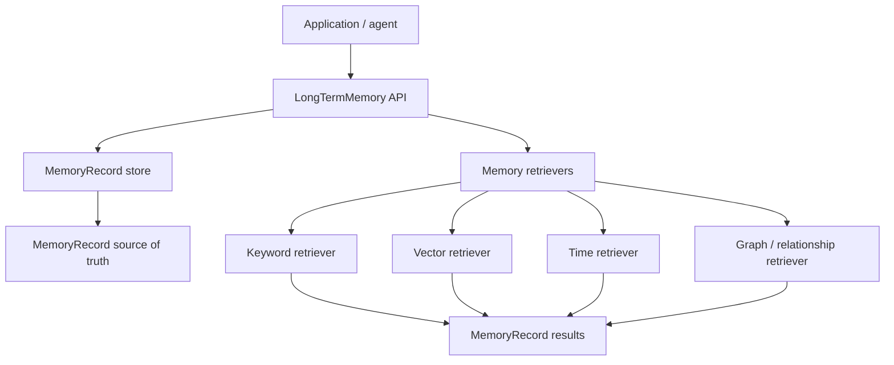
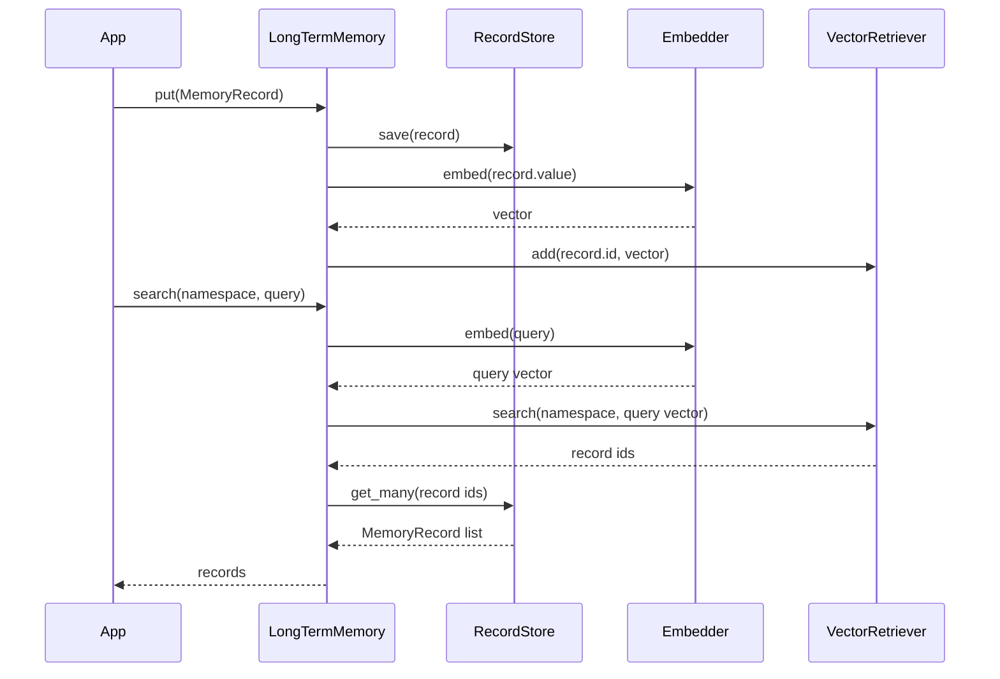
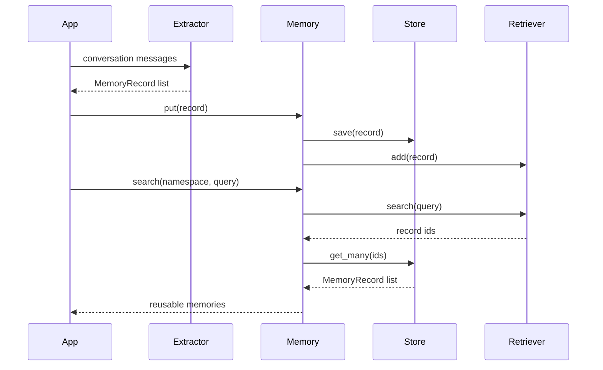
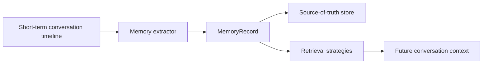

# Long-Term Memory Architecture

Long-term memory stores information that should be reusable beyond a single conversation thread.

This project uses one core principle:

```text
MemoryRecord is the source of truth.
Retrievers make records searchable.
```

That matters because vector embeddings, keyword search, graph edges, and timestamps are retrieval structures. They help the system find memory, but they are not the memory itself.

## Mental Model

Short-term memory answers:

```text
What happened in this conversation?
```

Long-term memory answers:

```text
What should be reusable later?
```

Examples:

```text
User prefers explicit Python types.
Decision: storage stays separate from context.
On 2026-06-18, the short-term memory architecture was refactored.
When history grows, summarize older messages and keep recent messages raw.
```

## Architecture

The long-term memory layer has two separate responsibilities:

```text
store   -> durable source of truth
retriever -> retrieval path
```



Proposed package shape:

```text
src/agent_memory/
  long_term/
    state.py       # MemoryRecord, MemoryType
    store.py       # LongTermMemoryStore protocol
    retriever.py   # MemoryRetriever protocol
    memory.py      # LongTermMemory public API
```

Storage adapters:

```text
src/agent_memory/storage/
  long_term_memory.py
  long_term_json.py
  long_term_sqlite.py
```

Retrieval strategies:

```text
src/agent_memory/retrieval/
  keyword.py
  vector.py
  time.py
  graph.py
```

External memory systems belong under:

```text
src/agent_memory/integrations/
  mem0.py
  zep.py
```

Source ingestion belongs under:

```text
src/agent_memory/ingestion/
  markdown.py
  json.py
  pdf.py
  folder.py
  claude_md.py
```

The first implementation can be simple, but the architecture should already make room for vector retrieval.

## MemoryRecord

The core record should be provider-independent and storage-independent.

```python
from dataclasses import dataclass, field
from datetime import datetime, timezone
from typing import Any, Literal
from uuid import uuid4


MemoryType = Literal[
    "semantic",
    "episodic",
    "procedural",
    "preference",
    "decision",
]


def utc_now() -> datetime:
    return datetime.now(timezone.utc)


@dataclass(frozen=True)
class MemoryRecord:
    namespace: tuple[str, ...]
    key: str
    value: str
    memory_type: MemoryType
    id: str = field(default_factory=lambda: str(uuid4()))
    created_at: datetime = field(default_factory=utc_now)
    updated_at: datetime | None = None
    metadata: dict[str, Any] = field(default_factory=dict)
```

The namespace scopes where the memory belongs.

Examples:

```python
("users", "user-123")
("projects", "llm-memory-from-scratch")
("threads", "thread-rag")
("organizations", "org-456")
```

The key identifies the memory inside that namespace.

Examples:

```python
"preference:python-types"
"decision:storage-boundary"
"event:short-term-refactor"
"procedure:summarize-history"
```

The value is the actual memory.

## Why Vectors Are Part Of The Architecture

A vector is not the memory. A vector is an index over the memory.

Memory:

```text
User prefers explicit Python types.
```

Embedding/vector:

```text
[0.12, -0.44, 0.88, ...]
```

The vector lets the system retrieve the memory by meaning.

Example:

```text
Query:
Does this user like type hints?

Relevant memory:
User prefers explicit Python types.
```

Keyword search might miss that. Vector search should find it.

So the long-term memory architecture should support this flow from the start:



## Memory Types

Memory types describe the meaning of a record. They should not become separate systems yet.

```text
semantic    -> facts and knowledge
episodic    -> events that happened
procedural  -> how-to workflows and agent behavior
preference  -> user or application preferences
decision    -> project or system decisions
```

The record shape remains the same. The storage and retrieval strategy can differ by `memory_type`.

## Semantic Memory

Semantic memory stores facts and knowledge.

Example:

```python
MemoryRecord(
    namespace=("projects", "llm-memory-from-scratch"),
    key="fact:prompt-management",
    value="The project stores prompts as YAML files and loads them through a prompt loader.",
    memory_type="semantic",
    metadata={
        "source": "architecture_discussion",
        "confidence": 0.95,
    },
)
```

Typical storage:

```text
MemoryRecord store
vector retriever
keyword retriever
metadata filters
```

Typical retrieval:

```text
semantic search
keyword search
namespace filter
memory_type filter
```

Semantic memory should usually be vector-searchable because users rarely ask for facts with exact wording.

## Episodic Memory

Episodic memory stores events or past experiences.

Example:

```python
MemoryRecord(
    namespace=("projects", "llm-memory-from-scratch"),
    key="event:short-term-memory-refactor:2026-06-18",
    value=(
        "Refactored the memory repo to separate context, storage, LLM messages, "
        "prompts, and settings."
    ),
    memory_type="episodic",
    metadata={
        "occurred_at": "2026-06-18",
        "repo": "/Users/admin/llm-memory-from-scratch",
        "thread_id": "thread-memory",
    },
)
```

Typical storage:

```text
MemoryRecord store
time retriever
vector retriever
metadata filters
```

Typical retrieval:

```text
time-bounded search
semantic search
project/thread filter
```

Episodic memory should preserve time and source metadata. It answers questions like:

```text
What happened last time?
When did we decide this?
What changed in this project?
```

## Procedural Memory

Procedural memory stores reusable workflows, rules, or behavior patterns.

Example:

```python
MemoryRecord(
    namespace=("projects", "llm-memory-from-scratch"),
    key="procedure:summarize-conversation-history",
    value=(
        "When conversation history grows, summarize older messages with an LLM, "
        "keep recent messages raw, preserve raw messages as the source of truth, "
        "and optionally persist the summary as a derived SummaryItem."
    ),
    memory_type="procedural",
    metadata={
        "source": "short_term_memory_architecture",
    },
)
```

Typical storage:

```text
MemoryRecord store
keyword retriever
optional vector retriever
direct key lookup
```

Typical retrieval:

```text
get by key for known procedures
semantic search for related workflows
load into prompt/system context when relevant
```

Procedural memory is often used as model instructions or task policy.

## Preference Memory

Preference memory stores durable user or application preferences.

Example:

```python
MemoryRecord(
    namespace=("users", "user-123"),
    key="preference:architecture-style",
    value="User prefers simple LangChain-style architecture over extra abstractions.",
    memory_type="preference",
    metadata={
        "confidence": 0.98,
        "source": "conversation",
    },
)
```

Typical storage:

```text
MemoryRecord store
vector retriever
direct key lookup
metadata filters
```

Typical retrieval:

```text
user namespace search
preference filter
semantic search
direct lookup for known preferences
```

Preference memory should be scoped carefully. A user preference should not accidentally leak into another user namespace.

## Decision Memory

Decision memory stores choices the project or system should not forget.

Example:

```python
MemoryRecord(
    namespace=("projects", "llm-memory-from-scratch"),
    key="decision:long-term-memory-shape",
    value=(
        "Use one long-term memory record store with namespace, key, value, "
        "memory_type, metadata, and retrievers. Do not create separate "
        "systems for each memory category."
    ),
    memory_type="decision",
    metadata={
        "status": "accepted",
        "reason": "Keeps the architecture flexible while supporting multiple retrieval strategies.",
        "decided_at": "2026-06-18",
    },
)
```

Typical storage:

```text
MemoryRecord store
keyword retriever
vector retriever
metadata filters
```

Typical retrieval:

```text
direct key lookup
project namespace search
semantic search over decisions
status filter
```

Decision memory is important for architecture continuity.

## Public API Shape

The public API should stay small.

```python
memory.put(record)
memory.get(namespace, key)
memory.search(namespace, query, memory_type=None)
memory.delete(namespace, key)
```

Example:

```python
memory.put(
    MemoryRecord(
        namespace=("users", "user-123"),
        key="preference:typing",
        value="User prefers explicit Python types.",
        memory_type="preference",
    )
)

record = memory.get(
    namespace=("users", "user-123"),
    key="preference:typing",
)

results = memory.search(
    namespace=("users", "user-123"),
    query="Does the user like type hints?",
    memory_type="preference",
)
```

## Store Protocol

The store owns the source of truth.

```python
class LongTermMemoryStore(Protocol):
    def put(self, record: MemoryRecord) -> None:
        ...

    def get(
        self,
        namespace: tuple[str, ...],
        key: str,
    ) -> MemoryRecord | None:
        ...

    def get_many(self, ids: list[str]) -> list[MemoryRecord]:
        ...

    def delete(
        self,
        namespace: tuple[str, ...],
        key: str,
    ) -> None:
        ...
```

This layer should work even if there is no vector retriever.

## Retriever Protocol

Retrievers make memory searchable.

```python
class MemoryRetriever(Protocol):
    def add(self, record: MemoryRecord) -> None:
        ...

    def search(
        self,
        namespace: tuple[str, ...],
        query: str,
        memory_type: MemoryType | None = None,
        limit: int = 5,
    ) -> list[str]:
        ...

    def delete(self, record_id: str) -> None:
        ...
```

The retriever returns record IDs. The store returns the full `MemoryRecord` objects.

That separation keeps retrieval flexible:

```text
keyword retriever -> record ids -> store -> MemoryRecord
vector retriever  -> record ids -> store -> MemoryRecord
graph retriever   -> record ids -> store -> MemoryRecord
```

## Retrieval Strategies

Start with:

```text
keyword retrieval
vector retrieval with fake embeddings
```

Then grow into:

```text
SQLite full-text search
real embedding model
hybrid keyword + vector search
time-bounded episodic search
graph relationship search
reranking
```

The API should not change when retrieval improves.

## Extraction

Long-term memory extraction turns conversation messages into durable memory records.

Example input:

```text
User: I prefer explicit Python types and I dislike overcomplicated abstractions.
```

Example extracted records:

```python
MemoryRecord(
    namespace=("users", "user-123"),
    key="preference:python-types",
    value="User prefers explicit Python types.",
    memory_type="preference",
)

MemoryRecord(
    namespace=("users", "user-123"),
    key="preference:simple-architecture",
    value="User dislikes overcomplicated abstractions.",
    memory_type="preference",
)
```

Extraction should be separate from storage and indexing.

```text
messages -> extractor -> MemoryRecord list -> memory.put(...)
```



## What Not To Do Yet

Do not create separate APIs like:

```python
semantic_memory.add(...)
episodic_memory.add(...)
preference_memory.add(...)
procedural_memory.add(...)
decision_memory.add(...)
```

That would make the architecture heavy too early.

Use one long-term memory API. Distinguish categories through `memory_type` and retrieval behavior.

## Relationship To Short-Term Memory

Short-term memory stores the conversation timeline:

```text
Message
Message
SummaryItem
Message
```

Long-term memory stores durable reusable records:

```text
MemoryRecord(namespace, key, value, memory_type, metadata)
```

Short-term memory is scoped to a thread.

Long-term memory is scoped to a namespace and retrieved through retrievers.



This keeps the system flexible without pretending vector stores, graph stores, and databases are the same thing.
