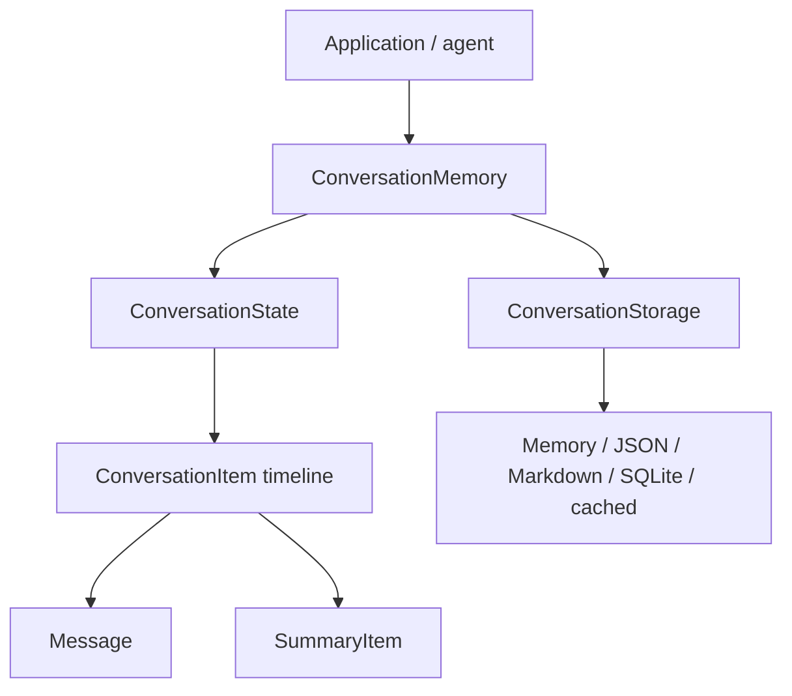
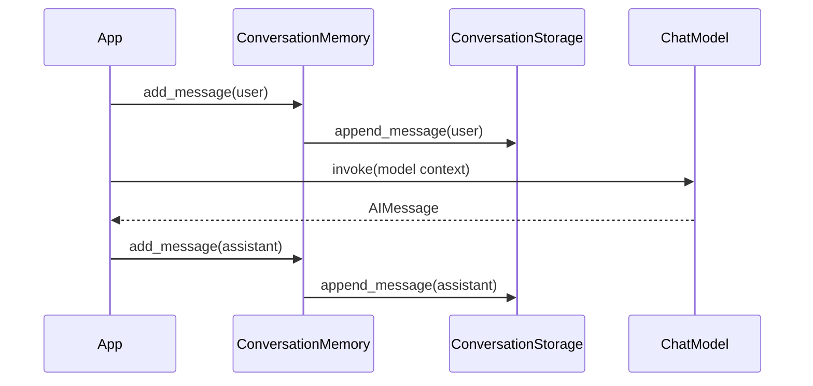
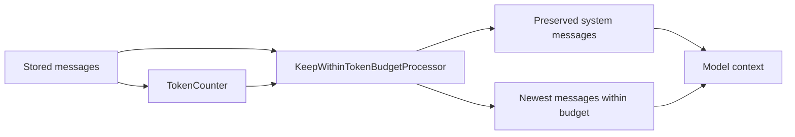
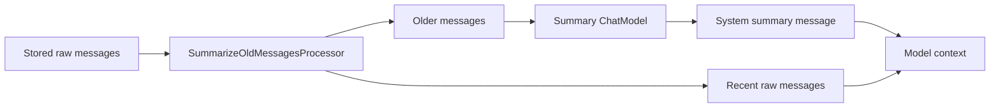
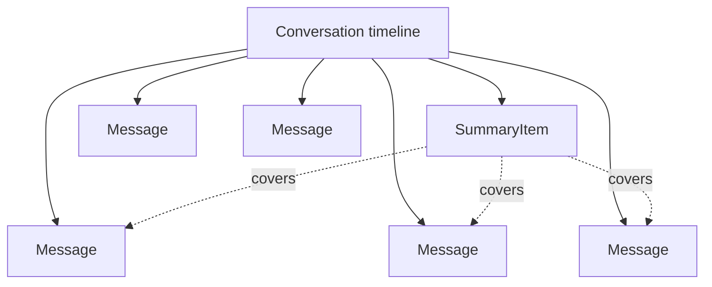

# Short-Term Memory Architecture

This module implements short-term conversation memory: the thread-scoped state required to continue a conversation across turns.

The design goal is intentionally narrow:

```text
Persist the ordered conversation timeline for a thread,
without coupling the conversation API to a specific storage backend.
```

This is not a LangGraph checkpointer and it is not long-term semantic memory. It is the conversation-history layer that higher-level agent, summary, and long-term memory systems can build on.

## Core Model

Short-term memory is modeled with three layers:

```text
Data model      -> Message, ConversationState
Application API -> ConversationMemory
Storage contract -> ConversationStorage
```

The separation matters:

```text
Message and ConversationState define what is stored.
ConversationMemory defines how application code interacts with memory.
ConversationStorage defines where and how memory is persisted.
```



Model-facing messages are kept separate from stored conversation items:

```text
conversation.state.Message -> internal persisted conversation message
llm.message.Message        -> provider-neutral message sent to a chat model
llm.adapters               -> conversion boundary
```

## Thread Identity

A `thread_id` identifies one conversation timeline.

Examples:

```text
thread-rag
thread-memory
support-case-123
```

Using the same `thread_id` continues the same conversation. Using a different `thread_id` starts or reads a different conversation.

This is the same architectural role as a conversation ID in many LLM systems: it scopes short-term state without implying that everything in the thread should become long-term memory.

## Message

`Message` represents a single conversational message.

Defined in:

```text
src/agent_memory/context/conversation/state.py
```

Current fields:

```text
id
role
content
created_at
run_id
model_name
usage
metadata
```

Example:

```python
Message(
    role="assistant",
    content="SQLite is a local database.",
    run_id="run-001",
    model_name="gpt-5.2",
    usage={
        "input_tokens": 30,
        "output_tokens": 12,
    },
    metadata={
        "finish_reason": "stop",
    },
)
```

The additional fields make the message useful beyond simple chat replay:

```text
run_id      -> correlates a message with the model/application execution that produced it
model_name  -> records which model produced the response
usage       -> stores token or usage accounting
metadata    -> stores provider-specific or application-specific details
```

This mirrors what production LLM systems usually need for tracing, debugging, evaluation, cost analysis, and provider comparison.

## ConversationState

`ConversationState` is the in-memory representation of one thread.

Defined in:

```text
src/agent_memory/context/conversation/state.py
```

It contains:

```text
thread_id
items
```

Example:

```python
ConversationState(
    thread_id="thread-rag",
    items=[
        Message(role="user", content="Explain reranking."),
        Message(role="assistant", content="Reranking sorts retrieved documents."),
    ],
)
```

`ConversationState` is deliberately passive. It does not know about files, databases, caches, or storage policies. It is just the state shape.

The `messages` property is a filtered view over `items`. That leaves room for the same conversation timeline to hold tool calls, tool results, retrieval records, and summary records without pretending every context item is a chat message.

## ConversationMemory

`ConversationMemory` is the application-facing API.

Defined in:

```text
src/agent_memory/context/conversation/memory.py
```

It exposes:

```text
add_message
get_messages
replace_messages
clear_thread
```

Example:

```python
memory.add_message(
    thread_id="thread-rag",
    role="user",
    content="Explain reranking.",
)
```

`ConversationMemory` creates `Message` objects and delegates persistence to the configured storage backend.

It does not know whether the backend is in-memory, JSON, Markdown, SQLite, cached, or remote. That keeps application code stable while storage choices evolve.

## Storage Contract

`ConversationStorage` defines the interface every backend must implement.

Defined in:

```text
src/agent_memory/storage/interface.py
```

The contract is append-first:

```text
get
create_thread
append_message
replace_messages
delete
```

The most important method is:

```text
append_message
```

Normal chat writes should append a single message. They should not rewrite the entire conversation on every turn.

`replace_messages` exists, but it is reserved for intentional state rewrites such as trimming, compaction, summarization, or manual correction.

## Persistence Point

Short-term memory is persisted when a meaningful conversation event happens.

For a normal turn:

```text
1. User message is received
2. Append user message
3. Model produces assistant response
4. Append assistant message
```



In this codebase, that persistence point is:

```python
ConversationMemory.add_message(...)
```

Internally, it calls:

```python
self._storage.append_message(...)
```

This gives the system crash-friendly behavior: if the model call fails after the user message is received, the user message can still be preserved.

## Storage Backends

The current storage implementations are:

```text
MemoryStorage
JsonStorage
MarkdownStorage
SQLiteStorage
CachedConversationStorage
```

Each backend implements the same `ConversationStorage` contract.

### MemoryStorage

Defined in:

```text
src/agent_memory/storage/memory.py
```

Stores conversation state in Python memory.

This backend is fast and useful for runtime caching, examples, and tests. It is not persistent across process restarts.

### JsonStorage

Defined in:

```text
src/agent_memory/storage/json.py
```

Stores conversation state in a JSON file.

This backend is useful for local structured persistence and inspection. It is simple and transparent, but not designed for high-concurrency workloads.

### MarkdownStorage

Defined in:

```text
src/agent_memory/storage/markdown.py
```

Stores conversation state as Markdown.

This backend optimizes for readability. It is useful when conversation traces should be easy for humans or LLMs to inspect directly.

### SQLiteStorage

Defined in:

```text
src/agent_memory/storage/sqlite.py
```

Stores conversation state in SQLite using a normalized schema:

```text
conversations
conversation_items
```

`conversations` stores the thread-level record.

`conversation_items` stores ordered items inside the conversation.

The item table currently supports these item types:

```text
message
tool_call
tool_result
retrieval
summary
```

The Python API currently writes message items. The schema is intentionally broader because modern LLM conversations are not only user and assistant messages; they also include tool calls, tool outputs, retrieved context, summaries, and execution metadata.

### CachedConversationStorage

Defined in:

```text
src/agent_memory/storage/cached.py
```

Combines a fast cache backend with a primary backend:

```python
storage = CachedConversationStorage(
    cache=MemoryStorage(),
    primary=SQLiteStorage(path=".memory/conversations.db"),
)
```

Read path:

```text
1. Read from cache
2. If present, return cached state
3. If missing, read from primary
4. Populate cache
5. Return state
```

Write path:

```text
1. Write to primary
2. Update cache
```

The primary backend remains the source of truth. The cache is an optimization layer.

This is intentionally similar to common cache-aside/write-through patterns used in application storage systems.

## SQLite Schema

SQLite stores conversation memory as a conversation plus ordered items.

Conceptual schema:

```text
conversations
  id
  created_at
  updated_at
  metadata

conversation_items
  id
  conversation_id
  item_type
  position
  role
  content
  created_at
  run_id
  model_name
  usage
  metadata
```

The `position` column preserves conversational order.

The `conversation_id` foreign key connects each item to its parent conversation.

`run_id`, `model_name`, `usage`, and `metadata` support tracing and observability.

## Message History Processing

Conversation storage is not the same thing as prompt construction.

The storage layer can keep the full short-term timeline, while processors decide what subset should be sent to a model.

Defined in:

```text
src/agent_memory/context/conversation/processors.py
```

Current processors include:

```text
KeepWithinTokenBudgetProcessor
FilterByRoleProcessor
SummarizeOldMessagesProcessor
ProcessorPipeline
```

This separation is important because model context should be selected intentionally. Persisting every message does not mean every message must be sent back to the model on every turn.

### Token Budget Trimming

`KeepWithinTokenBudgetProcessor` keeps recent context within a model token budget.

This is preferred over message-count trimming because one message can be tiny:

```text
yes
```

or extremely large:

```text
Here is a long traceback...
```

The processor does not guess tokenization. It receives a `TokenCounter`, so production code can use the tokenizer for the model being called.

```python
class TokenCounter(Protocol):
    def count_message(self, message: Message) -> int:
        ...
```

The trimming strategy is:

```text
1. Preserve leading system messages when configured.
2. Walk backward from the newest messages.
3. Keep adding message groups while the token budget allows.
4. Return the selected messages in original order.
```

Assistant messages with tool calls are grouped with following tool result messages. That prevents trimming from leaving a tool result without the assistant tool call that produced it.



### Conversation Summary Processing

`SummarizeOldMessagesProcessor` compresses older messages before model invocation.

It does not delete the stored conversation. It only prepares a smaller model context:

```text
summary of older messages
+
recent raw messages
```



The summary prompt is stored separately from code:

```text
src/agent_memory/prompts/conversation_summary.yaml
```

The processor loads the prompt through:

```text
src/agent_memory/prompts/loader.py
```

This follows the same pattern as the agentic RAG repo: prompts are versioned text assets, while processors contain orchestration logic.

The summary message includes metadata:

```text
kind = conversation_summary
covered_item_ids = ids of items summarized
```

That metadata makes it possible to trace which original messages were compressed into the summary.

## Persisted Summaries

Summaries can also be saved back into the conversation timeline as `SummaryItem`.

This does not make the summary the source of truth. The source of truth remains the raw conversation messages.

The stored timeline can contain both:

```text
Message
Message
Message
SummaryItem
Message
Message
```



This gives the system two useful views:

```text
raw messages       -> audit, replay, debugging, evaluation
summary items      -> cheaper model context, faster continuation
```

`ConversationMemory.add_summary(...)` persists a summary as a derived timeline item.

The summary records which items it covers:

```text
covered_item_ids
```

That makes the summary traceable. A reviewer can see exactly which earlier items were compressed into it.

## LLM Boundary

The conversation state is richer than the payload sent to a model.

Stored messages include:

```text
id
created_at
run_id
model_name
usage
metadata
tool_calls
```

LLM-facing messages are intentionally smaller and follow a LangChain-style naming convention:

```text
SystemMessage
HumanMessage
AIMessage
ToolMessage
ToolCall
```

Defined in:

```text
src/agent_memory/llm/message.py
```

The chat model interface is:

```text
ChatModel.invoke(messages) -> AIMessage
```

Defined in:

```text
src/agent_memory/llm/interface.py
```

Adapters convert internal messages to LLM-facing messages:

```text
src/agent_memory/llm/adapters.py
```

This boundary keeps provider/model concerns out of the stored conversation state.

## Relationship To LangGraph

This project does not implement LangGraph checkpoints.

LangGraph checkpointers persist graph execution state. That state can include messages, but it can also include routing decisions, tool outputs, intermediate node state, retries, and other graph-level data.

This project implements a lower-level conversation memory layer:

```text
thread_id -> ordered conversation items
```

The concepts are compatible:

```text
thread_id
state
messages
storage backend
```

But the scope is different:

```text
ConversationMemory -> conversation history
LangGraph checkpointer -> graph execution state
Long-term memory store -> durable knowledge across threads
```

Keeping those boundaries separate makes the system easier to extend.

## Design Decisions

### Append-first writes

Normal conversation events are appended one at a time.

This avoids rewriting the full thread for every new message and keeps the persistence model aligned with how conversations actually happen.

### Storage interface before storage choice

`ConversationMemory` depends on the `ConversationStorage` protocol, not on SQLite, JSON, or Markdown directly.

That makes it possible to move from local storage to Postgres, Redis, or another backend without rewriting the application API.

### Cache as a wrapper

Caching is implemented as `CachedConversationStorage`, not embedded into `ConversationMemory`.

That keeps caching optional and composable.

### Message metadata is first-class

Model name, run ID, usage, and metadata are part of the message model because production LLM systems need traceability.

Without those fields, it becomes difficult to debug which model produced a message, compare model behavior, analyze cost, or evaluate runs.

## Current Capabilities

Short-term memory currently supports:

```text
thread-scoped conversations
append-first message persistence
multiple interchangeable storage backends
cache + primary storage composition
message metadata and usage tracking
message history processors
model-message adapters
SQLite conversation item schema
```

## Next Extensions

The schema already anticipates richer conversation items.

Natural next steps:

```text
add_tool_call
add_tool_result
add_retrieval
add_summary
windowed reads
summary memory
long-term semantic memory
```

These should build on the existing boundary:

```text
ConversationMemory for API
ConversationStorage for persistence
Message/ConversationState for data shape
```
